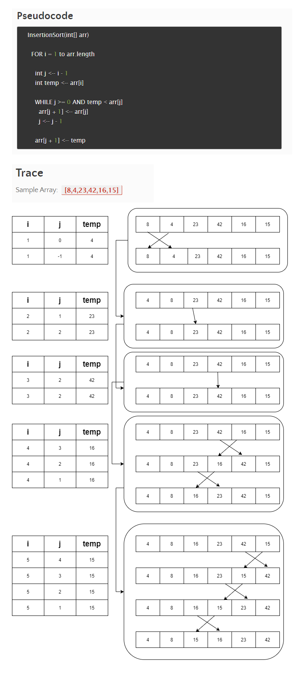

# ***Code Challenge: Class 26***

# ***Insertion Sort***

# ***Blog***

## Index

- [Feature Tasks](#Feature-Tasks)
- [step-by-step](#step-by-step)
- [Code Challenge: Class 26; Insertion Sort](README.md)

---

## ***Feature Tasks***

- [x] Review the pseudocode below in the figure, then I traced the algorithm by stepping through the process with the provided sample array which shown in the figure . Here in this blog article I show the step-by-step output after each iteration through some sort of visual.

----

## ***step-by-step***

