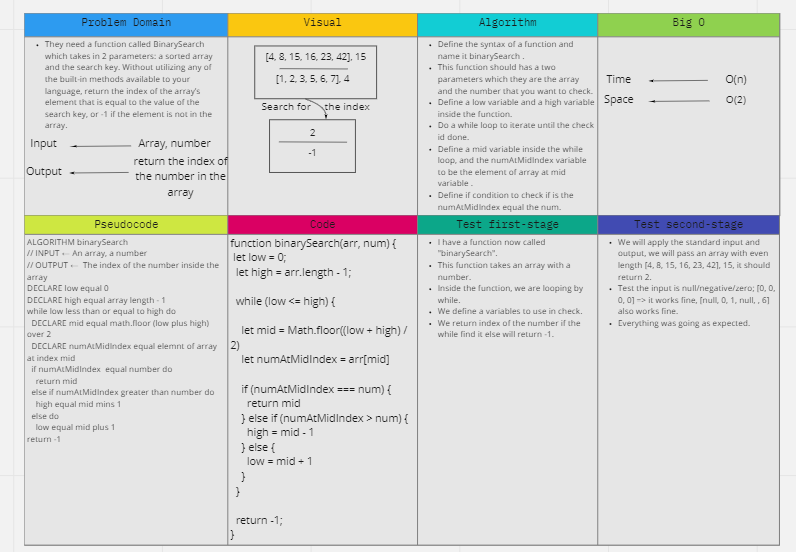
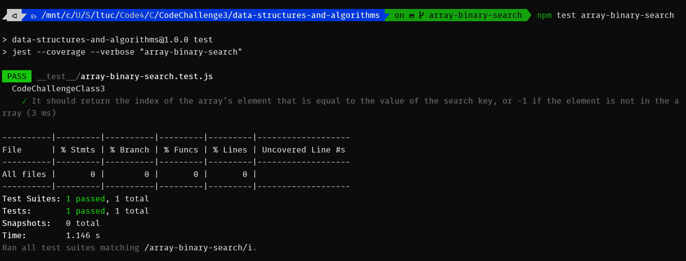

# ***Code Challenge: Class 03***

## ***Array binary search***

### ***Feature Tasks***

Write a function called BinarySearch which takes in 2 parameters: a sorted array and the search key. Without utilizing any of the built-in methods available to your language, return the index of the array’s element that is equal to the value of the search key, or -1 if the element is not in the array.

### ***Whiteboard Challenge Workflow***

The steps in this document are meant to show you one solid workflow. It’s a structure that works for most people to help them solve whiteboarding problems effectively.

1. **Problem Domain**
    - Re-iterate the problem domain that you have been asked. This can be done either verbatim from the initial question, or a summary in your own words, whatever makes more sense to you.

2. **Visual**
    - Draw out what the problem domain is and visually solve the problem. Label all of the appropriate properties, define your input and output, and show how you will approach the problem towards a solution.

3. **Algorithm**
    - The algorithm is a breakdown of what you need to achieve. This should be a bulleted list or a general overview of what you plan to implement later in the interview.

4. **Big O**
    - Analyze the space AND time efficiency of the algorithm that you just proposed. You should revisit this analysis throughout the interview as you make updates to your algorithm during pseudocode/code/stepthrough.

5. **Pseudocode**
    - Write out pseudocode that defines your algorithm! Use the pseudocode cheat sheet as a guideline to what symbols are acceptable.

6. **Code**
    - Write out syntactically correct code in the language of your course to solve the problem presented. Your real code should be based off of your pseudocode.

7. **Test**
    - There are two main parts to testing. First, walk through both the problem domain and your solution to make sure that it both works and is efficient. This should be a careful, line-by-line stepthrough of your code, where you track variables in a written table along the way. It’s very normal to start the stepthrough, realize that you have a bug in your code, and go back to your code to try and fix the bug; in this case, make sure to go back to careful stepthrough for any modified parts of your code.   Secondly, you should talk about how you would test this code if you were writing unit tests. This means listing out a variety of test cases; your goal is to show the interviewer that you know what kinds of tests are useful to ensure that a function is working. At a minimum, you want to list out:
        - a standard input and output
        - some edge cases in how the data is structured; you’ll probably list several of these (the array is already sorted! the tree is very unbalanced! the string is just the character ‘a’ twelve times! etc.)
        - the input is null/negative/zero (the “normal” edge cases)

### ***Illustration of those steps and the result of this Code Challenge; class:03***

 

#### ***Whiteboard Challenge Workflow***

#### ***Tests that applied***

- [4, 8, 15, 16, 23, 42], 15
  - to equal ➡️ 2
- [11, 22, 33, 44, 55, 66, 77], 90
  - to equal ➡️ -1
- [1, 2, 3, 5, 6, 7], 1
  - to equal ➡️ 0
- [0, 0, 0, 0] , 6
  - to equal ➡️ -1
- [null, 0, 1, null, , 6], 0
  - to equal ➡️ 1

#### ***Prove of testing***

- 

#### ***Testing Code***

- [To See The Test Code Clicks Me 🧪](../../__test__/array-binary-search.test.js)

### ***Approach & Efficiency***

 

- I took the same approach that explained above, and I choose it because it is the first time I did like this process, so I should be careful while doing it.

 

---

 

## Table of Contents

 

|  **Code Challenge**  |  **Title**  |   **ToGo** |
| ----------- | ----------- | ----------- |
| Main | Back to the Main | [Clicks me](../../README.md) |
| Class: 01 | Reverse an array | [Clicks me](../../Challenges/array-reverse/README.md) |
| Class: 02 | Array Shift | [Clicks me](../../Challenges/array-shift/README.md) |
| Class: 03 | Array Binary Search | [Clicks me](../../Challenges/array-binary-search/README.md) |
