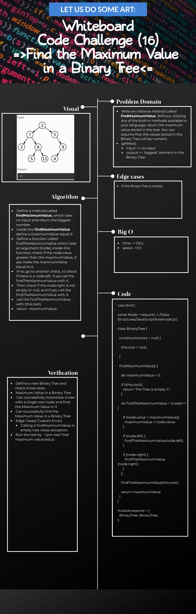
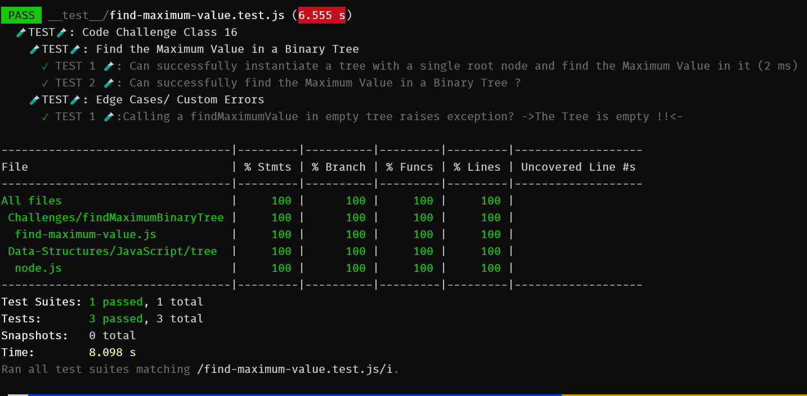

# ***Code Challenge: Class 16***

# ***Maximum Value in a Binary Tree***

## Index

- [Feature Tasks](#Feature-Tasks)
- [Whiteboard Challenge Workflow](#Whiteboard-Challenge-Workflow)
- [Code Challenge: Class 16](#Illustration-of-those-steps-and-the-result-of-this-Code-Challenge;-class-16)
  - [Whiteboard](#Whiteboard)
  - [Tests that applied](#Tests-that-applied)
  - [Run the test](#Run-the-test)
  - [Prove of testing](#Prove-of-testing)
  - [Testing Code](#Testing-Code)
  - [Approach & Efficiency](#Approach-&-Efficiency)

---

## ***Feature Tasks***

- [x] Write an instance method called find-maximum-value. Without utilizing any of the built-in methods available to your language, return the maximum value stored in the tree. You can assume that the values stored in the Binary Tree will be numeric.

**[⬆ Back to Index](#index)**

## ***Whiteboard Challenge Workflow***

The steps in this document are meant to show you one solid workflow. It’s a structure that works for most people to help them solve whiteboarding problems effectively.

1. **Problem Domain**
    - Re-iterate the problem domain that you have been asked. This can be done either verbatim from the initial question, or a summary in your own words, whatever makes more sense to you.

2. **Visual**
    - Draw out what the problem domain is and visually solve the problem. Label all of the appropriate properties, define your input and output, and show how you will approach the problem towards a solution.

3. **Algorithm**
    - The algorithm is a breakdown of what you need to achieve. This should be a bulleted list or a general overview of what you plan to implement later in the interview.

4. **Big O**
    - Analyze the space AND time efficiency of the algorithm that you just proposed. You should revisit this analysis throughout the interview as you make updates to your algorithm during pseudocode/code/stepthrough.

5. **Pseudocode**
    - Write out pseudocode that defines your algorithm! Use the pseudocode cheat sheet as a guideline to what symbols are acceptable.

6. **Code**
    - Write out syntactically correct code in the language of your course to solve the problem presented. Your real code should be based off of your pseudocode.

7. **Test**
    - There are two main parts to testing. First, walk through both the problem domain and your solution to make sure that it both works and is efficient. This should be a careful, line-by-line stepthrough of your code, where you track variables in a written table along the way. It’s very normal to start the stepthrough, realize that you have a bug in your code, and go back to your code to try and fix the bug; in this case, make sure to go back to careful stepthrough for any modified parts of your code.   Secondly, you should talk about how you would test this code if you were writing unit tests. This means listing out a variety of test cases; your goal is to show the interviewer that you know what kinds of tests are useful to ensure that a function is working. At a minimum, you want to list out:
        - a standard input and output
        - some edge cases in how the data is structured; you’ll probably list several of these (the array is already sorted! the tree is very unbalanced! the string is just the character ‘a’ twelve times! etc.)
        - the input is null/negative/zero (the “normal” edge cases)

**[⬆ Back to Index](#index)**

## ***Illustration of those steps and the result of this Code Challenge; class:16***

 

### **Whiteboard**

- `find-maximum-value` whiteboard:
  - 

**[⬆ Back to Index](#index)**

#### ***Tests that applied***

- Maximum Value in a Binary Tree
  - Can successfully instantiate a tree with a single root node and find the Maximum Value in it
  - Can successfully find the Maximum Value in a Binary Tree
- Edge Cases/ Custom Errors
  - Calling a findMaximumValue in empty tree raises exception

**[⬆ Back to Index](#index)**

#### ***Prove of testing***

- 

**[⬆ Back to Index](#index)**

#### ***Testing Code***

- [To See The Test Code Clicks Me 🧪](../../__test__/find-maximum-value.test.js)

**[⬆ Back to Index](#index)**

### ***Approach & Efficiency***

 

- I took the same approach that explained above, and I choose it because it is the first time I did like this process, so I should be careful while doing it.

 

**[⬆ Back to Index](#index)**

---

