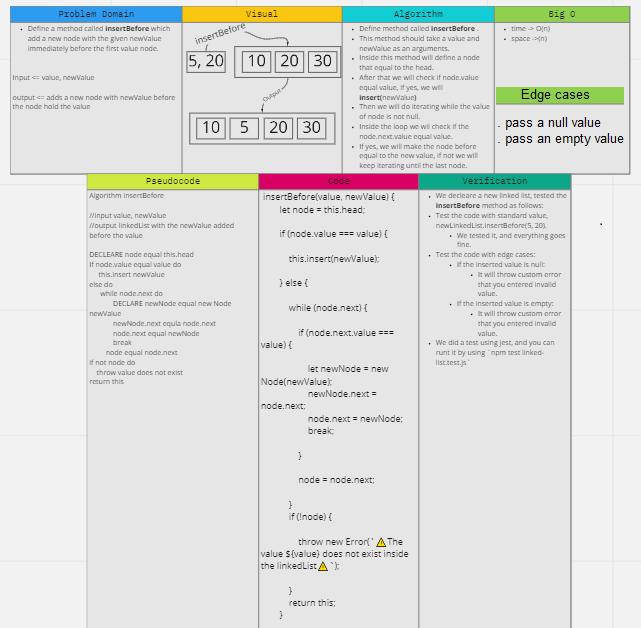
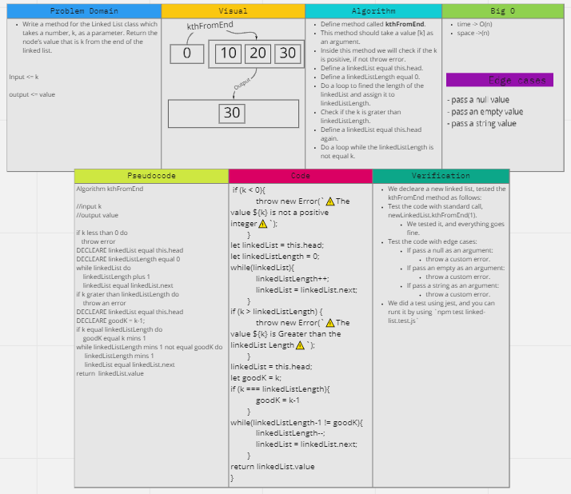

# ***Code Challenge: Class 05, class 06 and class 07***

# ***LinkedList***

## Index

- [Feature Tasks](#Feature-Tasks)
- [Whiteboard Challenge Workflow](#Whiteboard-Challenge-Workflow)
- [Code Challenge: Class 05, class 06 and class 07](#Illustration-of-those-steps-and-the-result-of-this-Code-Challenge;-class-05-class-06-and-class-07)
  - [Whiteboard](#Whiteboard)
  - [Tests that applied](#Tests-that-applied)
  - [Run the test](#Run-the-test)
  - [Prove of testing](#Prove-of-testing)
  - [Testing Code](#Testing-Code)
  - [Approach & Efficiency](#Approach-&-Efficiency)
- [Table of Contents](#Table-of-Contents)

---

## ***Feature Tasks***

## V1.1.5

- [x] Create a Node class that has properties for the value stored in the Node, and a pointer to the next Node.
- [x] Within your LinkedList class, include a head property. Upon instantiation, an empty Linked List should be created.
  - [x] Define a method called insert which takes any value as an argument and adds a new node with that value to the head of the list with an O(1) Time performance.
  - [x] Define a method called includes which takes any value as an argument and returns a boolean result depending on whether that value exists as a Node’s value somewhere within the list.
  - [x] Define a method called toString (or __str__ in Python) which takes in no arguments and returns a string representing all the values in the Linked List, formatted as:  
    `{ a } -> { b } -> { c } -> NULL`

## v1.1.6

- [x] `.append(value)` which adds a new node with the given `value` to the end of the list.
- [x] `.insertBefore(value, newVal)` which add a new node with the given `newValue` immediately before the first `value` node.
- [x] `.insertAfter(value, newVal)` which add a new node with the given `newValue` immediately after the first `value` node.

## v1.1.7

- [x] Write a method for the Linked List class which takes a number, `k`, as a parameter. Return the node’s value that is `k` from the end of the linked list. You have access to the Node class and all the properties on the Linked List class as well as the methods created in previous challenges.

**[⬆ Back to Index](#index)**

## ***Whiteboard Challenge Workflow***

The steps in this document are meant to show you one solid workflow. It’s a structure that works for most people to help them solve whiteboarding problems effectively.

1. **Problem Domain**
    - Re-iterate the problem domain that you have been asked. This can be done either verbatim from the initial question, or a summary in your own words, whatever makes more sense to you.

2. **Visual**
    - Draw out what the problem domain is and visually solve the problem. Label all of the appropriate properties, define your input and output, and show how you will approach the problem towards a solution.

3. **Algorithm**
    - The algorithm is a breakdown of what you need to achieve. This should be a bulleted list or a general overview of what you plan to implement later in the interview.

4. **Big O**
    - Analyze the space AND time efficiency of the algorithm that you just proposed. You should revisit this analysis throughout the interview as you make updates to your algorithm during pseudocode/code/stepthrough.

5. **Pseudocode**
    - Write out pseudocode that defines your algorithm! Use the pseudocode cheat sheet as a guideline to what symbols are acceptable.

6. **Code**
    - Write out syntactically correct code in the language of your course to solve the problem presented. Your real code should be based off of your pseudocode.

7. **Test**
    - There are two main parts to testing. First, walk through both the problem domain and your solution to make sure that it both works and is efficient. This should be a careful, line-by-line stepthrough of your code, where you track variables in a written table along the way. It’s very normal to start the stepthrough, realize that you have a bug in your code, and go back to your code to try and fix the bug; in this case, make sure to go back to careful stepthrough for any modified parts of your code.   Secondly, you should talk about how you would test this code if you were writing unit tests. This means listing out a variety of test cases; your goal is to show the interviewer that you know what kinds of tests are useful to ensure that a function is working. At a minimum, you want to list out:
        - a standard input and output
        - some edge cases in how the data is structured; you’ll probably list several of these (the array is already sorted! the tree is very unbalanced! the string is just the character ‘a’ twelve times! etc.)
        - the input is null/negative/zero (the “normal” edge cases)

**[⬆ Back to Index](#index)**

## ***Illustration of those steps and the result of this Code Challenge; class:05 and class 06***

 

### **Whiteboard**

## v1.1.5

- `insert` method:
  - 

- `includes` method:
  - 

- `toString` method:
  - 

## v1.1.6

- `append` method:
  - 

- `insertBefore` method:
  - 

- `insertAfter` method:
  - 

## v1.1.7

- `kthFromEnd` method:
  - 

**[⬆ Back to Index](#index)**

#### ***Tests that applied***

## v1.1.5

- Can successfully instantiate an empty linked list
- Can properly insert into the linked list
- The head property will properly point to the first node in the linked list
- Can properly insert multiple nodes into the linked list
- Will return true when finding a value within the linked list that exists
- Will return false when searching for a value in the linked list that does not exist
- Can properly return a collection of all the values that exist in the linked list
- Edge cases / custom error:
  - If insert not valid value in insert method
  - If insert not valid value in includes method
  - If pass a value as an argument in toString method
  - If the linkedList is empty and called toString method

## v1.1.6

- Can successfully add a node to the end of the linked list
- Can successfully add multiple nodes to the end of a linked list
- Can successfully insert a node before a node located i the middle of a linked list
- Can successfully insert a node before the first node of a linked list
- Can successfully insert after a node in the middle of the linked lis
- Can successfully insert a node after the last node of the linked list
- Edge cases / custom error:
  - If pass not valid value in append method
  - If pass not valid value in insertAfter method
  - If pass not valid value in insertBefore method

## v1.1.7

- Where k is greater than the length of the linked list ?
- Where k and the length of the list are the same ?
- Where k is not a positive integer ?
- Where the linked list is of a size 1 ?
- “Happy Path” where k is not at the end, but somewhere in the middle of the linked list ?
- Edge cases / custom error:
  - If pass a null value in kthFromEnd method
  - If pass an empty value in kthFromEnd method
  - If pass a string value in kthFromEnd method

**[⬆ Back to Index](#index)**

#### ***Prove of testing***

## v1.1.5

- 

## v1.1.6

- 

## v1.1.7

- 

**[⬆ Back to Index](#index)**

#### ***Testing Code***

## v1.1.5, v1.1.6 & v1.1.7

- [To See The Test Code Clicks Me 🧪](../../../__test__/linked-list.test.js)

**[⬆ Back to Index](#index)**

### ***Approach & Efficiency***

 

- I took the same approach that explained above, and I choose it because it is the first time I did like this process, so I should be careful while doing it.

 

**[⬆ Back to Index](#index)**
---

 

 

## Table of Contents

 

|  **Code Challenge**  |  **Title**  |   **ToGo** |
| ----------- | ----------- | ----------- |
| Main | Back to the Main | [Clicks me](../../../README.md) |
| Class: 01 | Reverse an array | [Clicks me](../../Challenges/array-reverse/README.md) |
| Class: 02 | Array Shift | [Clicks me](../../Challenges/array-shift/README.md) |
| Class: 03 | Array Binary Search | [Clicks me](../../Challenges/array-binary-search/README.md) |
| Class: 05, 06 & 07 | LinkedList | [Clicks me](README.md) |
