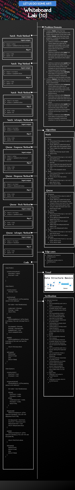
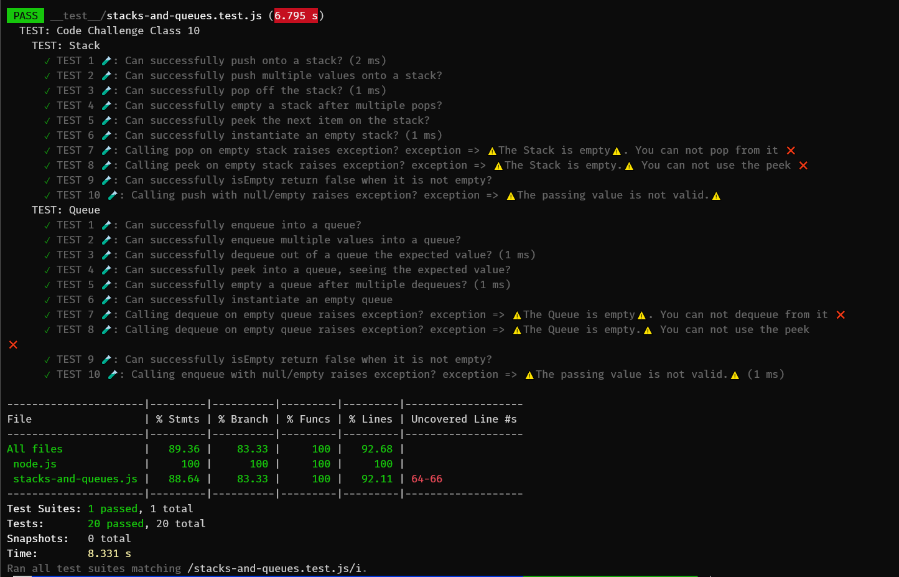

# ***Code Challenge: Class 10***

# ***Stacks and Queues***

## Index

- [Feature Tasks](#Feature-Tasks)
- [Whiteboard Challenge Workflow](#Whiteboard-Challenge-Workflow)
- [Code Challenge: Class 10](#Illustration-of-those-steps-and-the-result-of-this-Code-Challenge;-class-10)
  - [Whiteboard](#Whiteboard)
  - [Tests that applied](#Tests-that-applied)
  - [Run the test](#Run-the-test)
  - [Prove of testing](#Prove-of-testing)
  - [Testing Code](#Testing-Code)
  - [Approach & Efficiency](#Approach-&-Efficiency)
- [Table of Contents](#Table-of-Contents)

---

## ***Feature Tasks***

- [x] Create a Node class that has properties for the value stored in the Node, and a pointer to the next node.
- [x] Create a Stack class that has a top property. It creates an empty Stack when instantiated.
    - [x] This object should be aware of a default empty value assigned to top when the stack is created.
    - [x] Define a method called push which takes any value as an argument and adds a new node with that value to the top of the stack with an O(1) Time performance.
    - [x] Define a method called pop that does not take any argument, removes the node from the top of the stack, and returns the node’s value.
        - [x] Should raise exception when called on empty stack
    - [x] Define a method called peek that does not take an argument and returns the value of the node located on top of the stack, without removing it from the stack.
        - [x] Should raise exception when called on empty stack
    - [x] Define a method called isEmpty that takes no argument, and returns a boolean indicating whether or not the stack is empty.
- [x] Create a Queue class that has a front property. It creates an empty Queue when instantiated.
    - [x] This object should be aware of a default empty value assigned to front when the queue is created.
    - [x] Define a method called enqueue which takes any value as an argument and adds a new node with that value to the back of the queue with an O(1) Time performance.
    - [x] Define a method called dequeue that does not take any argument, removes the node from the front of the queue, and returns the node’s value.
        - [x] Should raise exception when called on empty queue
    - [x] Define a method called peek that does not take an argument and returns the value of the node located in the front of the queue, without removing it from the queue.
        - [x] Should raise exception when called on empty queue
    - [x] Define a method called isEmpty that takes no argument, and returns a boolean indicating whether or not the queue is empty.

**[⬆ Back to Index](#index)**

## ***Whiteboard Challenge Workflow***

The steps in this document are meant to show you one solid workflow. It’s a structure that works for most people to help them solve whiteboarding problems effectively.

1. **Problem Domain**
    - Re-iterate the problem domain that you have been asked. This can be done either verbatim from the initial question, or a summary in your own words, whatever makes more sense to you.

2. **Visual**
    - Draw out what the problem domain is and visually solve the problem. Label all of the appropriate properties, define your input and output, and show how you will approach the problem towards a solution.

3. **Algorithm**
    - The algorithm is a breakdown of what you need to achieve. This should be a bulleted list or a general overview of what you plan to implement later in the interview.

4. **Big O**
    - Analyze the space AND time efficiency of the algorithm that you just proposed. You should revisit this analysis throughout the interview as you make updates to your algorithm during pseudocode/code/stepthrough.

5. **Pseudocode**
    - Write out pseudocode that defines your algorithm! Use the pseudocode cheat sheet as a guideline to what symbols are acceptable.

6. **Code**
    - Write out syntactically correct code in the language of your course to solve the problem presented. Your real code should be based off of your pseudocode.

7. **Test**
    - There are two main parts to testing. First, walk through both the problem domain and your solution to make sure that it both works and is efficient. This should be a careful, line-by-line stepthrough of your code, where you track variables in a written table along the way. It’s very normal to start the stepthrough, realize that you have a bug in your code, and go back to your code to try and fix the bug; in this case, make sure to go back to careful stepthrough for any modified parts of your code.   Secondly, you should talk about how you would test this code if you were writing unit tests. This means listing out a variety of test cases; your goal is to show the interviewer that you know what kinds of tests are useful to ensure that a function is working. At a minimum, you want to list out:
        - a standard input and output
        - some edge cases in how the data is structured; you’ll probably list several of these (the array is already sorted! the tree is very unbalanced! the string is just the character ‘a’ twelve times! etc.)
        - the input is null/negative/zero (the “normal” edge cases)

**[⬆ Back to Index](#index)**

## ***Illustration of those steps and the result of this Code Challenge; class:10***

 

### **Whiteboard**

- `stacks-and-queues` whiteboard:
  - 

**[⬆ Back to Index](#index)**

#### ***Tests that applied***
- Stack
    - Can successfully push onto a stack
    - Can successfully push multiple values onto a stack
    - Can successfully pop off the stack
    - Can successfully empty a stack after multiple pops
    - Can successfully peek the next item on the stack
    - Can successfully instantiate an empty stack
    - Calling pop on empty stack raises exception
    - Calling peek on empty stack raises exception
    - Can successfully isEmpty return false when it is not empty
- Queue
    - Can successfully enqueue into a queue
    - Can successfully enqueue multiple values into a queue
    - Can successfully dequeue out of a queue the expected value
    - Can successfully peek into a queue, seeing the expected value
    - Can successfully empty a queue after multiple dequeues
    - Can successfully instantiate an empty queue
    - Calling dequeue on empty queue raises exception
    - Calling peek on empty queue raises exception
    - Can successfully isEmpty return false when it is not empty
- Edge cases:
  - Passing a null value to push/enqueue:
    - null
  - Passing an empty value to push/enqueue:
    -''

**[⬆ Back to Index](#index)**

#### ***Prove of testing***

- 

**[⬆ Back to Index](#index)**

#### ***Testing Code***

- [To See The Test Code Clicks Me 🧪](../../../__test__/stacks-and-queues.test.js)

**[⬆ Back to Index](#index)**

### ***Approach & Efficiency***

 

- I took the same approach that explained above, and I choose it because it is the first time I did like this process, so I should be careful while doing it.

 

**[⬆ Back to Index](#index)**
---

 

 

## Table of Contents

 

|  **Code Challenge**  |  **Title**  |   **ToGo** |
| ----------- | ----------- | ----------- |
| Main | Back to the Main | [Clicks me](../../../README.md) |
| Class: 01 | Reverse an array | [Clicks me](../../Challenges/array-reverse/README.md) |
| Class: 02 | Array Shift | [Clicks me](../../Challenges/array-shift/README.md) |
| Class: 03 | Array Binary Search | [Clicks me](../../Challenges/array-binary-search/README.md) |
| Class: 05, 06 & 07 | LinkedList | [Clicks me](../../Challenges/README.md) |
| Class: 08| LinkedList | [Clicks me](../../Challenges/README.md) |
| Class: 10| Stacks and Queues | [Clicks me](README.md) |